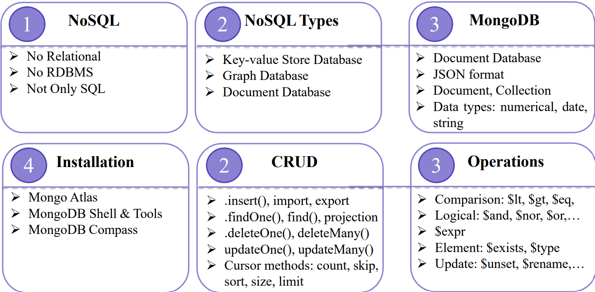

# Mogo Query Language (MQL)
MQL is syntax and operators you use to query and manipulate data in MongoDB.

Note that, the code below is writing in js.

## Creating / Deleting Databases and Collections

```js
show dbs
use <db_name>
show collections
db.createCollection('collection_name')
db.collection_name.drop()
// At the same database
db.dropDatabase() # In need of Atlas Admin role
```

## Inserting Documents

```js
// In a database
db.collection_name.insert(
    <document or array of documents>,
   {
      writeConcern: <document>,
      ordered: <boolean>
   }
)
```

Note that, the "_id" key in the key-value type NoSQL, must be unique and have an undersccore before it. If not include "_id", the db will create itself.

For example:

```js
db.student.insert(
    "_id": 1, 
    "name": "Hoang"
)
```
But, the insert() method has been deprecated in mongosh. So we need an alternative methods as:
```js
db.collection_name.insertOne(
    <document>,
    {
        writeConcern: <document>
    }
)

db.collection_name.insertMany(
    [ <document 1> , <document 2>, ... ],
    {
        writeConcern: <document>,
        ordered: <boolean>
    }
)
```

Reference document is in here https:#www.mongodb.com/docs/manual/reference/method/

## mongoimport and mongoexport

```js
mongoimport --uri="mongodb+srv:#<username>:<password>@<cluser_name>.nmvtsrq.mongodb.net/?retryWrites=true&w=majority&appName=<Cluster_name>" --collection=collection_name --file=file_name
```

```js
mongoexport --uri="mongodb+srv:#<username>:<password>@<cluser_name>.nmvtsrq.mongodb.net/?retryWrites=true&w=majority&appName=<Cluster_name>" --collection=test --out=test.json
```

Note that, "Cluster_name" is case sensitivity.

## Using the find and findOne Methods

```js
db.collection_name.findOne(
    query, projection, options
)
# -> all the samples including the references
```


```js
db.collection_name.findOneAndABC()
#ABC can be in ["Update", "Delete", "Replace"]
```

## "$" Operator
The "$" is not a single "thing."
Instead, it’s a prefix used to indicate "operators" or "system variables."

This is an operator that tells MongoDB how to interpret this part of the query.


## Comparison Operators

```js
$eq
$gt
$gte # greater than or equal
$in
$lt
$lte
$ne
$nin
```

Example:
```js
{"salary":{$in:[1,2]}}
```

## Logical Operators

```js
$and
$not
$nor
$or
```

Example:
```js
{ $and: [ { <expression1> }, { <expression2> } , ... , { <expressionN> } ] }
```

## Evaluation Query

```js
$expr
$jsonSchema
$mod
$regex
$where
```

### $expr
Creating a mini aggregation, can be helpful with calculation that needs calling many columns, and help doing complex calculation

For example: 
```js
db.orders.find({
  $expr: { $gt: ["$quantity", "$price"] }
})

```

Wrong usage:
```js
db.orders.find({ quantity: { $gt: price } })
```

## Element Operations

```js
$exist: { field: { $exists: <boolean> } }
$type: { field: { $type: <BSON type> } } or { field: { $type: [ <BSON type1> , <BSON type2>, ... ] } }
```

| **Type**              | **Number** | **Alias**               | **Notes**  |
| --------------------- | ---------- | ----------------------- | ---------- |
| Double                | 1          | `"double"`              |            |
| String                | 2          | `"string"`              |            |
| Object                | 3          | `"object"`              |            |
| Array                 | 4          | `"array"`               |            |
| Binary data           | 5          | `"binData"`             |            |
| Undefined             | 6          | `"undefined"`           | Deprecated |
| ObjectId              | 7          | `"objectId"`            |            |
| Boolean               | 8          | `"bool"`                |            |
| Date                  | 9          | `"date"`                |            |
| Null                  | 10         | `"null"`                |            |
| Regular Expression    | 11         | `"regex"`               |            |
| DBPointer             | 12         | `"dbPointer"`           | Deprecated |
| JavaScript            | 13         | `"javascript"`          |            |
| Symbol                | 14         | `"symbol"`              | Deprecated |
| JavaScript with scope | 15         | `"javascriptWithScope"` | Deprecated |
| 32-bit integer        | 16         | `"int"`                 |            |
| Timestamp             | 17         | `"timestamp"`           |            |
| 64-bit integer        | 18         | `"long"`                |            |
| Decimal128            | 19         | `"decimal"`             |            |
| Min key               | -1         | `"minKey"`              |            |
| Max key               | 127        | `"maxKey"`              |            |


## Cursor Methods
```js
limit()
skip()
sort()
toArray()
forEach()
explain()
count() // countDocuments() - collection method
size() //estimateDocumentCount() - collection method
```

### limit()
- Limit the number of documents return
- Syntax: 
```js
 db.collection_name.find(<query>).limit(<number>)
 ```

For example:
```js
db.orders.find().limit(5)
```

### skip()
- Skip the first number of documents
- Syntax:
```js 
db.collection_name.skip(<offset>)
```

For example: 
```js
db.orders.find().skip(10).limit(5)
```

### sort()
- Sort the return according to the specific key
- Syntax: 
```js 
db.collection_name.skip({field: value})
// value param can be 1 or -1 due to acs or des
```

For example: 
```js
db.orders.find().sort({price: 1, quantity: -1})
```

### toArray()
- Result returns as array
- Syntax: 
```js
db.collection_name.find().toArray()
```

For example: 
```js
var results = db.orders.find().limit(3).toArray()
```

### forEach()
- Loop through each document in Cursor
- Syntax:
```js
db.collection_name.find().forEach( <function> )
```

For example: 
```js
db.orders.find().forEach(function(doc) {
    print("Order ID: " + doc._id + " - Customer: " + doc.customerName)
})
```

### explain()
- Return Execution Plan of query, use to enhence efficience
- Syntax: 
```js
db.collection_name.find().explain()
```

For example:
```js
db.orders.find({price: {$gt: 100}}).explain("executionStats")
```

### count()

### size()

## Projection
- Choose which feature to output: 
- Syntax:
```js
db.collection_name.find(query, projection)

db.companies.find(
  { name: "Yahoo!" },
  { name: 1, external_links: 1 }
)

```

For example: 
```js
db.companies.find({}, {"name": "Yahoo!"})
```
## Querying Embedded Documents
- Find document with inner feature
- Syntax: 
```js
db.collection_name.find({
    "field.subField": value
})
```

For example:
```js
db.companies.find({"external_links.title": "GM Yahoo! Personals Lorna Borenstein Interview  10/04"})
```

## Querying Array

```js
$all // having
.find({field,{$all:[value1,value2,…]}})
// Return all documents where the value of a field is an array that contains all the specified elements and ordering doesn’t matter

$size // len ==
.find({field,{$size:value}})
// Returns all documents that match the specified array size

$elemMatch // in 
.find({field,{$elemMatch:{{query1},{query2},…}}})
// Returns documents that contain an array field with an element that contains the matching criteria
```

## Deleting Documents
```js
deleteOne()
deleteMany()
```

## Updating Documents

```js
updateOne()
updateMany()

// Operators
$unset
db.collection_name.updateMany({filter},{$unset:{field:value,…}})
// Deletes a particular field

$rename
db.collection_name.updateMany({filter},{$rename:{field:value,…}})
// Updates the name of a field

$inc
db.collection.updateMany({filter},{$inc:{field:value,…}})
// Increments a field by a specified value

$push
db.collection.updateMany({filter},{$push:{field:value,…}})
// Appends a specified value to an array

$set
db.collection.updateMany({filter},{$set:{field:value,…}})
// Replaces the value of a field with the specified value
```

## Summary

